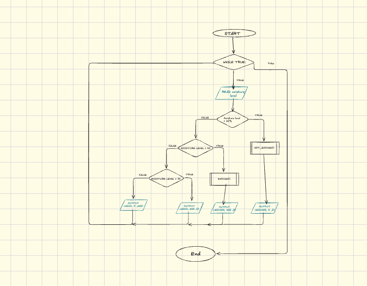

# Assesment Task 2
##### By Mazen Nassar

## Requirements Outline

 ### The Need
 My family has recently gotten into growing and nurturing plants. A major part of growing plants is giving them sufficient water and making sure they they dont drown or shrivel up. Due to everyday life, sometimes the plant goes forgotten for long periods of time thus influencing the amount of water it recieves.


 ### Proposed Solution
 My proposed solution is to create a system which measure the level of moisture in the soil and then uses an rgb LED to output how high the moisture levels are with red indicating moisture levels between 0% and 20%, yellow between 21% and 40%, green indicating between 40% and 70%, blue indicating 70% and above 


 ### Key Actions
 + System accurately measures moisture level in the soil
 + System indicates the moisutre level using the rgb LED
 + System sets the rgb to red if plant needs more water to ensures its arrival


 ### Functional Requirements
   + Accurately reads and calculates moisture
   + When soil moisture levels fall under 20% the rgb LED turns red
   + When soil moisture levels are between 20% & 40% the rgb LED turns yellow to signal that the moisture level is getting better
   + When soil moisture levels are between


### Test Cases
| Test Case             | Input                                   | Expected Output   |
|----------             |----------                               |----------------   |
|Sufficient moisturae   | soil moisture sensor reads >40% & <70%  | LED turns Green   |
|Insufficient moisture  | soil moisture sensor reads <20%         | LED turns Red     |
|Excessive moisture     | soil moisture sensor reads >70%         | LED turns blue    | 


### Non-Functional Requirements
 + __Clean Circuitry:__ Clean presentable circuitry which minimises the space taken by the project


 ## Algorithm

### Flowchart
. ### COME BACK TO THIS


 ### Pseudocode
```
BEGIN
      WHILE true
         READ moisture_levels
         IF moisture_level < 20
            OUTPUT LED(255,0,0)
         ELSE IF moisture_level < 40
            OUTPUT LED(255,255,0)
         ELSE IF moisture_level < 70
            OUTPUT LED(0,255,0)
         ELSE
            OUTPUT LED(0,0,255  )
         ENDIF
      ENDWHILE
END

```

### Testing & Debugging
Moisture Sensor Test:

The Moisture sensor I was using  [keyestudio](https://wiki.keyestudio.com/Ks0049_keyestudio_Soil_Humidity_Sensor#Sample_Code_2) was a resistive sensor, meaning it sensed moisture levels by seeing how much voltage passes through the circuit. This works because water is a conducter meaning when the sensor is put in soil the voltage in the circuit is directly influenced by how much water there is in the soil to conduct the electricity. In a perfect world (Ideal Conditions) the ADC readings from the sensor in air should be ~0 and in water should be ~65,000.

As I ran my initial test I noticed that the ADC reading  from the sensor when I dipped it into a cup of water was maxing out at ~35,000, After carefully inspecting my code to ensure there were no software issues, a closer lok at the hardware caused me to realise the issue, my sensor was a 5V sensor while the raspberry pi pico pins can only handle up to 3.3V meaning the gpio pin can only output a max of 36,000 instead of 65,000. One "solution" includes supplying power for the sensor from the VBUS pin (Pin 40) however this risks overloading the pico's GPIO pin. To fix this I calibrated the wet value to ensure correct moisture readings:

```max_moisture = 65000``` -------->  ```max_moisture = 35000```

Another issue I encountered during this intial test was the percentage conversion was stuck at 0.8-0.9% even when the sensor was dipped in water, Seeing this I took a look at the code for calculating the percentage and realised because the code reading the value was outside the while loop it was only reading it once and outputing that. It was an easy fix with me putting the code inside of the while loop

LED light strip:
my project utilises the [lorikeet](https://piaustralia.com.au/products/little-bird-lorikeet-ws2812b-rainbow-board) which is a 5V sensor. I plugged the power wire into the VBUS pin. With this sensor however we will not run into issues such as the pico frying the board becuase the voltage is too high, this is becuase the LED strip isn't writing anything to the board. Then I connected the signal pin into GPIO pin 28 and the ground wire into a ground pin.

I ran into an issue when trying to make the light strip light up. In this code I was trying to set each pixel to the colour individually and it would refuse to run giving me an empty script. After some searching I found a solution courtesy of [Micropython Documentation Page](https://docs.micropython.org/en/latest/library/neopixel.html) which showed me I could just use fill()
```
    for i in range[num_LED]:
        pixels = colour
    pixels.write
```

``` fill() ```

After overcoming this issue the lights still would not turn on however after looking at my code I realised I had forgotten to add a parentheses when writing the colour data onto the LED strip

```pixels.write``` ----> ```pixels.write()```


## Evaluation

#### **Note: During my Video due to unforeseen rainy nights the plant was already watered meaning I could only showcase 2 of the colours that the system is able to output**

### PMI

|Positve | Negative | Implications|
|:----   |  :------:| :----       |  
|Emerson: This design sufficiently shows of the plants soil <br>is moist enough|could add more colours that change from red to yellow <br> then green for how moist it is to give a more accurate reading| The design works and does the job it needs to however <br> maybe some more vareity in how I showcase the progress is needed| 
|Michael:it detected the moisture accurately when place into the soil.The system displayed <br> that the detection is in a good/bad range on a very bright and visable LED panel|Only a light is outputting that the moisture level is in a bad range| The bright LED display and accuracy of the system let’s me know whether moisture is low or not, <br> however adding a buzzer or some other output would make it more noticeable


### Functional Requirements:
In my functional requirements I outlined 2 main goals, An accurate moisture sensing  + accurate percentage calculations and for an LED strip to output how much moisture is in it to show whether the plant needs more water. During testing, as I held the sensor out of the soil it correctly printed ~1% moisture while in the air and when I put the sensor in the soil, it correctly printed out ~60% meaning the sytem completes the first requirement of accurate measurement and calculation. During testing the LED correctly switched colours depending on moisture levels meaning it fufilled the requirement. In the air the LED was red while when put in soil depending on the moisture level it was either yellow, green or blue each colour outlining a new percentage bracket with green indicating healthy and blue indicating overwatered plants.


### Non-Functional Requirements:
In my non-functional requiremnts  I highlighted that the system should have clean presentable wiring and I believe it lives up to that standard even including colour coded wires such as red for the power and black / grey for the ground, for each of the sensors.

### Evaluation based on Need:
My original need was: A system which could measure and accuratley output the percentage of moisture in a plant as sometimes in my household plants can get forgotten for long periods of time. I believe my project does a good enough job of this, while it doesnt output exact percentages it is still accurate in determining whether a plant needs water or not as it outputs a specific colour depending on which bracket the moisture percentage is in with <20% being shown as red, between 20% and 40% shown as yellow, 40% to 70% as green and 70% and above being indicated as blue. The healthy range for plants is around the 40% to 70% range so as long as the LED outputs green it means your plant is fine.

### Project management Evaluation:
In relations to my project management I believe it was going smoothly at first with me finishing the the requirements outline and the algorithims within the first week and moving on to complete the main code by the 3rd week in spite of the PASS snow trip providing a major disruption. I finished the testing and debugging section a week before this task was due however I left the evaluation to the very last minute  causing stress and panicked responses.


### Peer Feedback
The feedback I recieved was incredibly  helpful and it tells me what I managed to do right  and what maybe needed a bit more work.Both Michael and Emerson commended my system for fufiling the need I described earlier. However there was also some constructive feedback, according to my peers my projects way of outputting the moisture level is good but may need some more variation such as adding a buzzer perhaps whe nteh mositire gets over 85%.


### Future Improvements:
I believe my project completed the required need and fullly functional. Adding more feautures however would make it a lot better, One feature could be adding a buzzer and making it ring when the moisture gets above a certain level, for example you are water the plant and it starts to buzz when it reaches 85% because any further could drown the plant, another improvement could be using the LED light strip to show percentage by how many of the lights are filled. As there are 5 LEDs in the strip each LED could represent 20% and the brightneess of each LED could indicate smaller percentages.This is becuase in my peer review it was said that I needed more variety in outputing my data as to provide a better experience to the user.