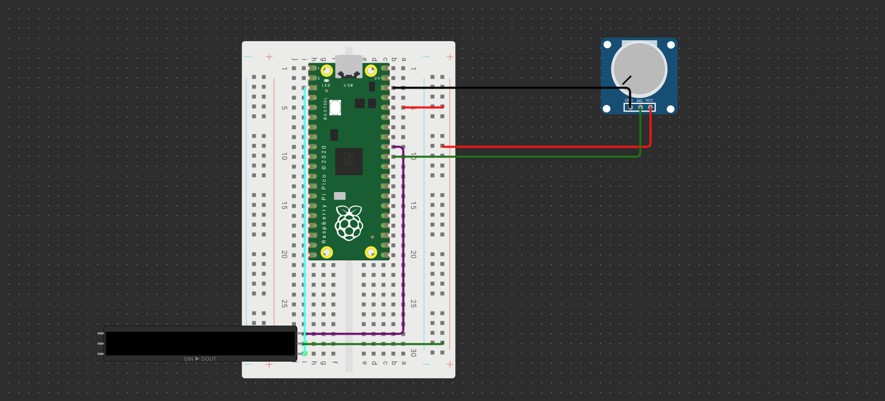

## Wiring

I used [Wowki](https://wokwi.com/pi-pico) to provide a diagram of the system however since Wowki didnt have a resource for the moisture sensor I am using a potentiometer to relpace it in the diagram as they work similarly